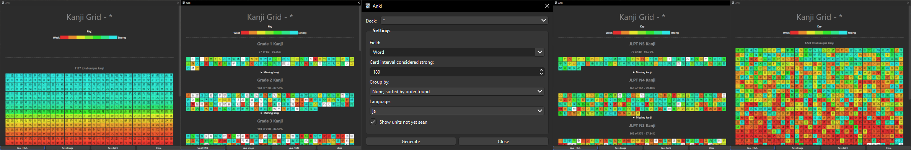

# Kanji Grid Kuuube

Kanji Grid for Anki 23.10+ with ui improvements and bug fixes.

## Installation

1. Open Anki.

2. On the top menu, go to `Tools` > `Add-ons`.

3. Click `Get Add-ons...`.

4. Input `1610304449`.

5. Click `OK`.

6. Restart Anki.

## Usage

1. On the top menu, go to `Tools` > `Generate Kanji Grid`.

2. Select the deck to generate from with the `Deck` dropdown.

3. Select the card field to check for kanji with the `Field` dropdown or type in multiple fields to check.

    Use the following format for searching multiple fields: `field1 field2 "field with spaces"`.

4. Optionally, edit any of the other settings to your liking.

4. Click `Generate`.

## Improvements

- Field selector now uses a dropdown/text box combo instead of a text box.

- All decks can be searched at once by selecting `*` in the deck dropdown.

- Key and key label are now centered.

- Kanji grid and header line now fill the entire window width.

- Background color is no longer hardcoded and will adapt to your Anki theme.

- Default window size is larger to better fit modern display resolutions.

- Chinese character groupings can be selected.

- Added Basic Kanji Book (BKB) V1 & V2 grouping.

- Added option to export Kanji Grid as JSON.

- Kanji are rendered in a dynamic grid that will adapt to window size instead of a static table.

- Automatically set language tag based on grouping and manual language tag setting.

## Bug Fixes

- `Save HTML` and `Save Image` now properly function.

- Fields with spaces in their name are now properly searchable.

- Fixed divide by zero error when no kanji are found and a kanji grouping is selected.

- Fixed JLPT kanji lists missing some characters.

## Info

[Github Repository](https://github.com/Kuuuube/kanjigrid)

[Report Issues Here](https://github.com/Kuuuube/kanjigrid/issues)
